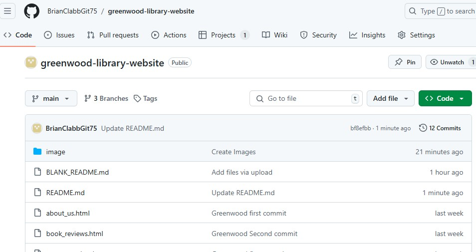
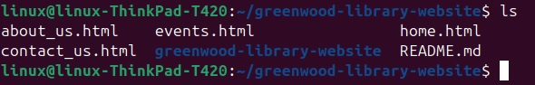
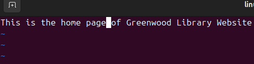
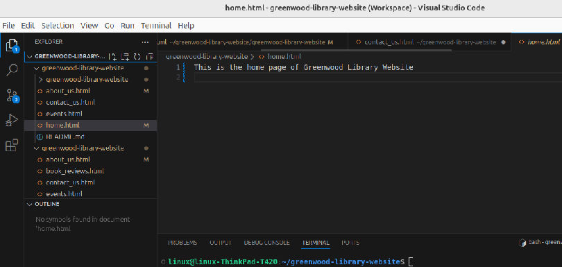
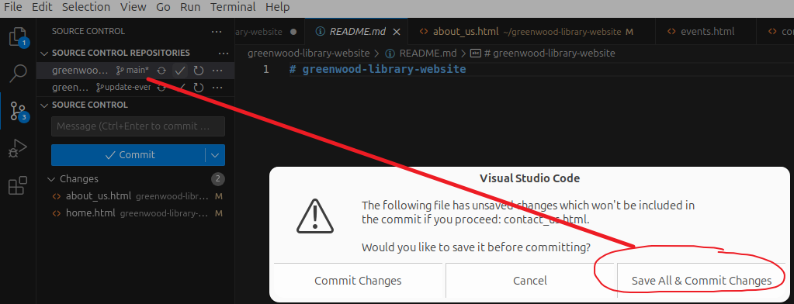
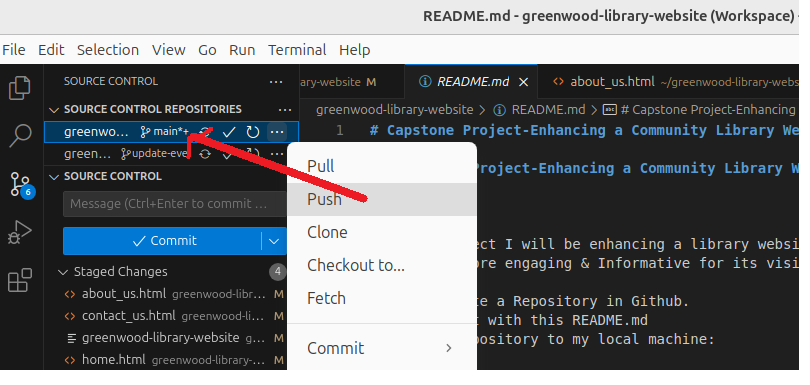

# Capstone Project-Enhancing a Community Library Website

## Capstone Project-Enhancing a Community Library Website

**Project**

In this project I will be enhancing a library website called Greenwood Community Library. The website aims to be more engaging & Informative for its visitors. 

Setup:  Create a Repository in Github.
Initialize it with this README.md
Clone the Repository to my local machine:

```markdown
git clone https://github.com/BrianClabbGit75/greenwood-library-website.git
```

I have created a GitHub Repository, please see screengrabs - this can be seen in the url, and on the cmd line:





Task1 - Create the following web page files in VS Code Editor, in the main branch of Greenwood Library Website:

```markdown
home.html
about_us.html
events.html
contact_us.html
```
Task 2 - This was performed on my Linux Ubuntu Machine. You can see the files on VS Code, and using vim command to enter text within the files:
```markdown
vim home.html
```


See the four files now on VSCode Editor



Task 3- We now Stage, Commit - saving any changes to the 'Main' Branch:-  



Push changes to the main branch:



