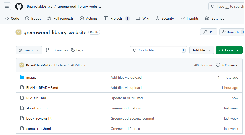

# Capstone Project-Enhancing a Community Library Website

## Capstone Project-Enhancing a Community Library Website

**Project**

In this project I will be enhancing a library website called Greenwood Community Library. The website aims to be more engaging & Informative for its visitors. 

Setup:  Create a Repository in Github.
Initialize it with this README.md 

I have created a GitHub Repository, please see screengrabs - this can be seen in the url, and on the cmd line:

