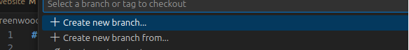
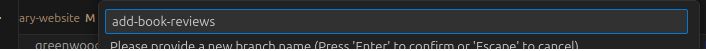
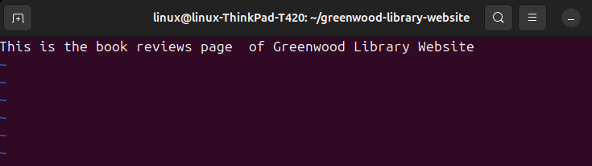

# Capstone Project-Enhancing a Community Library Website

## Capstone Project-Enhancing a Community Library Website

**Project**

In this project I will be enhancing a library website called Greenwood Community Library. The website aims to be more engaging & Informative for its visitors. First of all, we will simulate fictional character **'Morgan's'** contribution:

Setup:  Create a Repository in Github.
Initialize it with this README.md
Clone the Repository to my local machine:

```markdown
git clone https://github.com/BrianClabbGit75/greenwood-library-website.git
```

I have created a GitHub Repository, please see screengrabs - this can be seen in the url, and on the cmd line:


Task1 - Create the following web page files in VS Code Editor, in the main branch of Greenwood Library Website:

```markdown
home.html
about_us.html
events.html
contact_us.html
```
Task 2 - This was performed on my Linux Ubuntu Machine. You can see the files on VS Code, and using vim command to enter text within the files:
```markdown
vim home.html
```


See the four files now on VSCode Editor


Task 3- We now Stage, Commit - saving any changes to the 'Main' Branch:-  


Push changes to the main branch:


Next-for **Morgan**, we create another branch, ***add-book-reviews***





We then created the file, within this branch, called **book_reviews.html**, and added somme text:


Like before we

```markdown
Staged
Commit
Pushed Changed
and Raised a PR
```
...For this branch

We then ***merged*** **add-book-reviews** branch to the **main** branch.


Finally, we will simulate fictional character **'Jamie's'** contribution, which will be to be create the new branch ***update-events***, and pull  the latest changes from the ***main*** branch.

# Please enter the commit message for your changes. Lines starting
# with '#' will be ignored, and an empty message aborts the commit.
#
# On branch update-events
Your branch is up to date with 'origin/update-events'.


